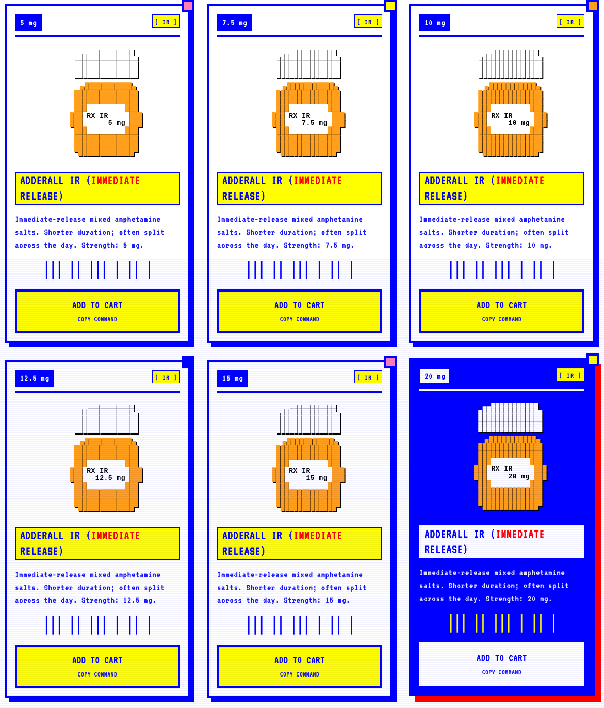

<p align="center">
  
</p>

<h1 align="center">adderall</h1>

<p align="center">
  <em>A dosage-based meta-skill pack for <a href="https://docs.claude.com/en/docs/agents-and-tools/agent-skills/overview">Claude</a>, <a href="https://docs.cursor.com">Cursor</a>, <a href="https://developers.openai.com/codex">Codex</a>, and <a href="https://hermes-agent.nousresearch.com">Hermes Agent</a>.</em>
  <br/>
  <sub>Control <strong>how strictly</strong> an agent follows another skill &mdash; not just what it does.</sub>
</p>

<p align="center">
  <a href="https://www.npmjs.com/package/adderall"></a>
  
  
  
  
  
  =18" />
  
  
</p>

---

## Install in one line

```bash
npx adderall install all
```

That's it. No clone, no build step, no Python, no Docker. The CLI ships the seven `SKILL.md` files inside the npm package and copies them to the correct location for each platform.

Prefer to pick platforms individually:

```bash
npx adderall install claude        # → ~/.claude/skills/adderall-<dose>
npx adderall install cursor        # → ~/.cursor/skills/adderall-<dose>
npx adderall install codex         # → ~/.codex/skills/ + AGENTS.md block
npx adderall install hermes        # → ~/.hermes/skills/adderall-<dose>
```

Pin adderall to the current repo instead of the user profile:

```bash
npx adderall install cursor --project     # → ./.cursor/skills/adderall-<dose>
npx adderall install codex  --project     # → ./.codex/skills/ + ./AGENTS.md block
```

Remove cleanly:

```bash
npx adderall uninstall all
```

Audit what's installed and where:

```bash
npx adderall doctor
```

See `npx adderall help` for every command. Detailed per-platform rules live in [`INSTALL.md`](./INSTALL.md).

## RX Shelf

<p align="center">
  
</p>

## Dosage Guide

| Skill              | Adherence | Flexibility | Intended Use              |
| ------------------ | :-------: | :---------: | ------------------------- |
| `adderall-5mg`     |   0.10    |    0.90     | Open-ended exploration    |
| `adderall-7.5mg`   |   0.25    |    0.75     | Flexible guidance         |
| `adderall-10mg`    |   0.50    |    0.50     | Balanced execution        |
| `adderall-12.5mg`  |   0.70    |    0.30     | High adherence            |
| `adderall-15mg`    |   0.85    |    0.15     | Near-strict execution     |
| `adderall-20mg`    |   0.95    |    0.05     | Strict execution          |
| `adderall-30mg`    |   1.00    |    0.00     | Maximal literal adherence |

## How It Works

Prefix a target skill invocation with a dosage skill:

```text
/adderall-10mg /frontend-ui build a login page
/adderall-20mg /python-debug investigate failing tests
/adderall-5mg  /research-arxiv survey recent work on sparse autoencoders
```

At runtime:

1. The dosage skill resolves the **target skill** that follows it.
2. It sets the expected **adherence** (how literally instructions must be followed) and **flexibility** (how much initiative the agent may take).
3. The agent executes the target skill through that behavioral lens &mdash; no edits to the target skill required.

## One SKILL.md, Four Platforms

A single `SKILL.md` per dosage is valid on every supported platform. No per-platform forks; no duplicate content. Each platform reads the fields it understands and ignores the rest.

| Platform            | Skills path                               | Activation                                                  |
| ------------------- | ----------------------------------------- | ----------------------------------------------------------- |
| **Claude Code**     | `~/.claude/skills/adderall-<dose>/`       | Auto-loaded; matches description triggers                   |
| **Claude Desktop**  | Upload a `.zip` per skill via the UI      | Toggle in the skill panel                                   |
| **Cursor**          | `~/.cursor/skills/adderall-<dose>/`       | Listed in the skill picker / slash menu                     |
| **Codex CLI**       | `~/.codex/skills/adderall-<dose>/` + `AGENTS.md` block | Auto-loaded; `/adderall-<dose>` triggers execution   |
| **Hermes Agent**    | `~/.hermes/skills/adderall-<dose>/`       | `hermes skills list`                                        |

## Choosing a Dosage

- **Low dosages (`5mg`, `7.5mg`)** &mdash; prefer when you want optional ideas, broader exploration, or creative extensions beyond the target skill.
- **Mid dosage (`10mg`)** &mdash; prefer when the target skill should be respected but not over-applied.
- **High dosages (`12.5mg` &rarr; `30mg`)** &mdash; prefer when consistency, repeatability, and literal compliance matter more than initiative.

## CLI Reference

```text
npx adderall <command> [options]

Commands:
  install <platform>        Install adderall on a platform (or 'all')
  uninstall <platform>      Remove adderall from a platform (or 'all')
  doctor                    Report where adderall is installed
  list                      List the 7 dosages and their profiles
  info <dose>               Print a dosage's SKILL.md
  help                      Show the full help screen

Options:
  --project                 Install at project scope (./.<platform>/skills)
  --link                    Use symlinks instead of copies (dev mode)

Platforms:
  claude, cursor, codex, hermes, all
```

## SKILL.md Format

Every skill uses a single unified frontmatter that is valid on all four target platforms:

```yaml
---
name: adderall-10mg
description: Balanced execution dosage — adherence 0.50, flexibility 0.50. Use when the user prefixes a target skill with /adderall-10mg.
version: 1.0.0
author: adhdcreator
license: MIT
metadata:
  hermes:
    tags: [Meta, Control, Dosage, adderall]
    related_skills: [adderall-7.5mg, adderall-12.5mg]
---
```

- **Claude / Cursor** read the top-level `name` and `description` and treat the body as instructions. Extra fields are ignored.
- **Codex** reads the description via the `AGENTS.md` block; skill bodies are accessible under `~/.codex/skills/`.
- **Hermes** reads the full frontmatter including `metadata.hermes.tags` and `related_skills`.

See [`templates/SKILL.template.md`](templates/SKILL.template.md) for the scaffold, [`AUTHORING.md`](AUTHORING.md) for conventions, and [`INSTALL.md`](INSTALL.md) for the exact rules each platform enforces.

## Repository Structure

```text
adderall/
├── bin/
│   └── adderall.js              # CLI entry point (published as `adderall` bin)
├── src/
│   ├── cli.js                   # argv parser + command dispatcher
│   ├── logger.js                # zero-dep ANSI logger
│   ├── fsutil.js                # zero-dep fs helpers (copy / symlink / rm)
│   └── platforms.js             # claude + cursor + codex + hermes adapters
├── skills/
│   ├── adderall-5mg/SKILL.md
│   ├── adderall-7.5mg/SKILL.md
│   ├── adderall-10mg/SKILL.md
│   ├── adderall-12.5mg/SKILL.md
│   ├── adderall-15mg/SKILL.md
│   ├── adderall-20mg/SKILL.md
│   └── adderall-30mg/SKILL.md
├── templates/
│   └── SKILL.template.md
├── assets/
│   ├── banner.png               # Top banner (pharmacy-grade cover art)
│   ├── bannerpills.png          # RX shelf — one bottle per dosage
│   └── {banner,pills}.{txt,ans} # CP437 ASCII fallbacks
├── AUTHORING.md                 # How skills in this repo are authored
├── CHANGELOG.md
├── INSTALL.md                   # Detailed per-platform install guide
├── LICENSE                      # MIT, (c) adhdcreator
├── package.json                 # npm manifest (bin: "adderall")
└── README.md
```

All skills in this repository are authored by **[adhdcreator](https://github.com/adhdcreator)**. External contributions are not accepted; issues and discussions are welcome.

## Philosophy

> A skill tells the agent *what* to do. A dosage tells the agent *how much of itself* to bring to it.

`adderall` treats adherence as a first-class, tunable parameter &mdash; the same way temperature tunes sampling. This keeps target skills pure (no scattered "be strict" / "be creative" flags) and makes agent behavior reproducible across sessions, users, and platforms.

## License

MIT (c) [adhdcreator](https://github.com/adhdcreator). See [`LICENSE`](./LICENSE).
