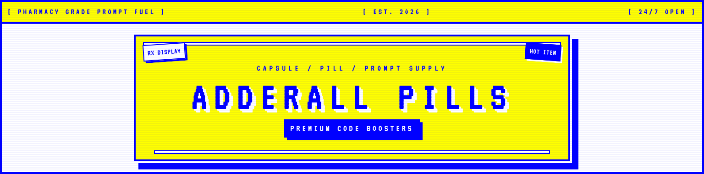

<!-- Top banner: rendered in color by GitHub via the ansi code fence -->

```ansi
╔══════════════════════════════════════════════════════════════════════════╗
║  [ PHARMACY GRADE PROMPT FUEL ]    [ EST. 2026 ]    [ 24/7 OPEN ]        ║
╚══════════════════════════════════════════════════════════════════════════╝

┌─[ RX DISPLAY ]────────────────────────────────────────[ HOT ITEM ]──────┐
│                                                                         │
│             C A P S U L E   /   P I L L   /   P R O M P T               │
│                                                                         │
│    █████╗ ██████╗ ██████╗ ███████╗██████╗  █████╗ ██╗     ██╗           │
│   ██╔══██╗██╔══██╗██╔══██╗██╔════╝██╔══██╗██╔══██╗██║     ██║           │
│   ███████║██║  ██║██║  ██║█████╗  ██████╔╝███████║██║     ██║           │
│   ██╔══██║██║  ██║██║  ██║██╔══╝  ██╔══██╗██╔══██║██║     ██║           │
│   ██║  ██║██████╔╝██████╔╝███████╗██║  ██║██║  ██║███████╗███████╗      │
│   ╚═╝  ╚═╝╚═════╝ ╚═════╝ ╚══════╝╚═╝  ╚═╝╚═╝  ╚═╝╚══════╝╚══════╝      │
│                                                                         │
│             ▓▓▓   P R E M I U M   C O D E   B O O S T E R S   ▓▓▓       │
│                                                                         │
└─────────────────────────────────────────────────────────────────────────┘

                  ░░ BY  ADHDCREATOR  //  MIT  LICENSE ░░
```

<h1 align="center">adderall</h1>

<p align="center">
  <em>A dosage-based meta-skill pack for <a href="https://hermes-agent.nousresearch.com">Hermes Agent</a>.</em>
  <br/>
  <sub>Control <strong>how strictly</strong> an agent follows another skill &mdash; not just what it does.</sub>
</p>

<p align="center">
  
  
  
  
</p>

<!-- Optional high-res product card / pharmacy banner (drop PNGs into assets/) -->
<p align="center">
  
</p>

---

## Overview

Most skill libraries describe **what** an agent should do. They rarely describe **how strictly** it should do it.

`adderall` adds a thin, reusable control layer on top of any existing Hermes skill. Each dosage is itself a skill that modulates the agent's adherence and flexibility when executing a *target* skill. The same base skill can then be used with different behavioral lenses &mdash; exploratory on `5mg`, literal on `30mg` &mdash; without duplicating instructions.

## RX Shelf

```ansi
╔══════════════════════════════════════════════════════════════════════════╗
║                        R X   S H E L F   //   C P 4 3 7                  ║
╚══════════════════════════════════════════════════════════════════════════╝

  ┌───────────┐   ┌───────────┐   ┌───────────┐   ┌───────────┐
  │ │ │ │ │ │ │   │ │ │ │ │ │ │   │ │ │ │ │ │ │   │ │ │ │ │ │ │
  ├───────────┤   ├───────────┤   ├───────────┤   ├───────────┤
  │███████████│   │███████████│   │███████████│   │███████████│
  │█ ┌─────┐ █│   │█ ┌─────┐ █│   │█ ┌─────┐ █│   │█ ┌─────┐ █│
  │█ │RX IR│ █│   │█ │RX IR│ █│   │█ │RX IR│ █│   │█ │RX IR│ █│
  │█ │ 5mg │ █│   │█ │7.5mg│ █│   │█ │10mg │ █│   │█ │12.5 │ █│
  │█ └─────┘ █│   │█ └─────┘ █│   │█ └─────┘ █│   │█ └─────┘ █│
  │███████████│   │███████████│   │███████████│   │███████████│
  └───────────┘   └───────────┘   └───────────┘   └───────────┘
   ADDERALL-5MG    ADDERALL-7.5    ADDERALL-10     ADDERALL-12.5
    exploration      guidance       balanced        adherence


  ┌───────────┐   ┌───────────┐   ┌───────────┐
  │ │ │ │ │ │ │   │ │ │ │ │ │ │   │ │ │ │ │ │ │
  ├───────────┤   ├───────────┤   ├───────────┤
  │███████████│   │███████████│   │███████████│
  │█ ┌─────┐ █│   │█ ┌─────┐ █│   │█ ┌─────┐ █│
  │█ │RX IR│ █│   │█ │RX IR│ █│   │█ │RX XR│ █│
  │█ │15mg │ █│   │█ │20mg │ █│   │█ │30mg │ █│
  │█ └─────┘ █│   │█ └─────┘ █│   │█ └─────┘ █│
  │███████████│   │███████████│   │███████████│
  └───────────┘   └───────────┘   └───────────┘
   ADDERALL-15     ADDERALL-20     ADDERALL-30
    near-strict      strict          literal


┌──────────────────────────────[ CAPSULES ]───────────────────────────────┐
│                                                                         │
│   ░░░░░░▒▒▒▒▒▒▓▓▓▓▓▓██████    ██████▓▓▓▓▓▓▒▒▒▒▒▒░░░░░░                  │
│  ░░░░░░░▒▒▒▒▒▒▓▓▓▓▓▓████████  ████████▓▓▓▓▓▓▒▒▒▒▒▒░░░░░░░               │
│  ░░░░░░░▒▒▒▒▒▒▓▓▓▓▓▓████████  ████████▓▓▓▓▓▓▒▒▒▒▒▒░░░░░░░               │
│   ░░░░░░▒▒▒▒▒▒▓▓▓▓▓▓██████    ██████▓▓▓▓▓▓▒▒▒▒▒▒░░░░░░                  │
│       low-dose capsule            high-dose capsule                     │
│                                                                         │
└─────────────────────────────────────────────────────────────────────────┘

                      ░░ RX PROMPT FUEL  ///  ADHDCREATOR ░░
```

<sub>Prefer a static image? Drop <code>assets/pills.png</code> into the repo and it renders below.</sub>

<p align="center">
  
</p>

## Dosage Guide

| Skill              | Adherence | Flexibility | Intended Use              |
| ------------------ | :-------: | :---------: | ------------------------- |
| `adderall-5mg`     |   0.10    |    0.90     | Open-ended exploration    |
| `adderall-7.5mg`   |   0.25    |    0.75     | Flexible guidance         |
| `adderall-10mg`    |   0.50    |    0.50     | Balanced execution        |
| `adderall-12.5mg`  |   0.70    |    0.30     | High adherence            |
| `adderall-15mg`    |   0.85    |    0.15     | Near-strict execution     |
| `adderall-20mg`    |   0.95    |    0.05     | Strict execution          |
| `adderall-30mg`    |   1.00    |    0.00     | Maximal literal adherence |

## How It Works

Prefix a target skill invocation with a dosage skill:

```text
/adderall-10mg /frontend-ui build a login page
/adderall-20mg /python-debug investigate failing tests
/adderall-5mg  /research-arxiv survey recent work on sparse autoencoders
```

At runtime:

1. The dosage skill resolves the **target skill** that follows it.
2. It sets the expected **adherence** (how literally instructions must be followed) and **flexibility** (how much initiative the agent may take).
3. The agent executes the target skill through that behavioral lens &mdash; no edits to the target skill required.

## Choosing a Dosage

- **Low dosages (`5mg`, `7.5mg`)** &mdash; prefer when you want optional ideas, broader exploration, or creative extensions beyond the target skill.
- **Mid dosage (`10mg`)** &mdash; prefer when the target skill should be respected but not over-applied.
- **High dosages (`12.5mg` &rarr; `30mg`)** &mdash; prefer when consistency, repeatability, and literal compliance matter more than initiative.

## Repository Structure

```text
adderall/
├── skills/
│   ├── adderall-5mg/SKILL.md
│   ├── adderall-7.5mg/SKILL.md
│   ├── adderall-10mg/SKILL.md
│   ├── adderall-12.5mg/SKILL.md
│   ├── adderall-15mg/SKILL.md
│   ├── adderall-20mg/SKILL.md
│   └── adderall-30mg/SKILL.md
├── templates/
│   └── SKILL.template.md        # Canonical SKILL.md scaffold
├── assets/
│   ├── banner.txt               # Plain CP437 banner
│   ├── banner.ans               # ANSI-colored banner (cat in a terminal)
│   ├── pills.txt                # Plain CP437 pill rack
│   └── pills.ans                # ANSI-colored pill rack
├── docs/                        # Extended design notes
├── AUTHORING.md                 # How skills in this repo are authored
├── CHANGELOG.md
├── LICENSE                      # MIT, (c) adhdcreator
└── README.md
```

All skills in this repository are authored by **[adhdcreator](https://github.com/adhdcreator)**. External contributions are not accepted; issues and discussions are welcome.

## Preview in a Terminal

```bash
# Full-color CP437 banner
cat assets/banner.ans

# Full-color RX shelf
cat assets/pills.ans

# Plain (no color)
cat assets/banner.txt
cat assets/pills.txt
```

## Installation

Install any dosage skill directly from this repo with the Hermes CLI:

```bash
hermes skills tap add adhdcreator/adderall
hermes skills install adderall-10mg
```

Or install the full pack:

```bash
hermes skills install adderall-5mg adderall-7.5mg adderall-10mg \
                      adderall-12.5mg adderall-15mg adderall-20mg adderall-30mg
```

## SKILL.md Format

All skills in this repo follow the canonical [Hermes Agent SKILL.md format](https://hermes-agent.nousresearch.com/docs/developer-guide/creating-skills):

```yaml
---
name: adderall-10mg
description: Balanced execution dosage &mdash; adherence 0.50, flexibility 0.50.
version: 1.0.0
author: adhdcreator
license: MIT
metadata:
  hermes:
    tags: [Meta, Control, Dosage, adderall]
    related_skills: [adderall-5mg, adderall-20mg, adderall-30mg]
---
```

See [`templates/SKILL.template.md`](templates/SKILL.template.md) for the full scaffold, and [`AUTHORING.md`](AUTHORING.md) for the conventions used across the pack.

## Philosophy

> A skill tells the agent *what* to do. A dosage tells the agent *how much of itself* to bring to it.

`adderall` treats adherence as a first-class, tunable parameter &mdash; the same way temperature tunes sampling. This keeps target skills pure (no scattered "be strict" / "be creative" flags) and makes agent behavior reproducible across sessions and users.

## License

MIT (c) [adhdcreator](https://github.com/adhdcreator). See [`LICENSE`](./LICENSE).
